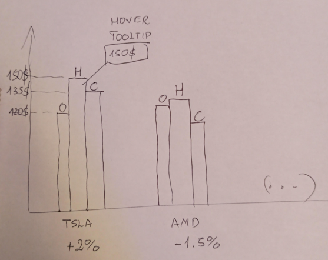

# Foreword

The following document is an assignment for Poznan University of Technology's Data Visualization course. The course is conducted by Dariusz Brzeziński during the 4th semester of Artificial Intelligence Bachelor degree.

The assignment is an implementation of the grammar of graphics, intended to create rich visualizations from the data we were provided with. The data consists of two data sets, for both of which we've chosen the upcoming visualizations. As it is stated in the assignment description:

* The data in the Sectors folder present the percentage changes of stock prices and trading volume in selected sectors
    + Some of the data sets also contain information about the media sentiment about the companies
* The Correlations.csv data set contains correlations between the stock prices of pairs of companies identified by stock symbols (tickers)

For both the following visualizations, we will provide brief descriptions and reasoning behind them.

On top of that, we add an anticlimactic digression regarding one of the ideas for Sectors data visualization. It includes the sketches that may make up for their lack in case of the main visualizations.

## Credits

We have to credit the lecturer, **Dariusz Brzeziński**, for the interactive tables we have used. They were built using the `DT` package.

The interactive tables should work as intended in html format of the document, however they will not be visible in pdf format. For that reason, a standard head of the data frames are displayed.

```{r db_table, message=FALSE, warning=FALSE}
library(DT)

# credit: Dariusz Brzeziński
prettyTable <- function(table_df, round_columns_func=is.numeric, round_digits=2) {
    DT::datatable(table_df, style="bootstrap", filter = "top", rownames = FALSE, extensions = "Buttons", options = list(dom = 'Bfrtip', buttons = c('copy', 'csv', 'excel', 'pdf', 'print'))) %>%
    formatRound(unlist(lapply(table_df, round_columns_func)), round_digits)
}
```


## Resources

For the above reason, and also the fact exporting .Rmd to pdf may not preserve the correct images placement, we highly recommend checking out the html version.

You can access the project's repository on [GitHub - https://github.com/bujowskis/put-DV/tree/main/ass-2](https://github.com/bujowskis/put-DV/tree/main/ass-2)

---

# Stocks by sectors

## The data

*For simplicity reasons (and keeping this document relatively short), we are going to show two out of 8 data sets. One of them will be a representative of the sets with sentiments included, and the other one with sentiments missing.*

### Sentiment included

```{r sentiment_repr, echo=FALSE}
head(read.csv("Dataset/Sectors/IT.csv"))
prettyTable(read.csv("Dataset/Sectors/IT.csv"))
```

---

### Sentiment missing

```{r nosentiment_repr, echo=FALSE}
head(read.csv("Dataset/Sectors/energy.csv"))
prettyTable(read.csv("Dataset/Sectors/energy.csv"))
```

## Sketch

Before diving in, we would like to emphasize we tried to prepare the visualization with the goal of possibly being a tool that could be helpful during the trading. For that reason, the chosen interpretation represents rather the most relevant data, which points the receiving person to the most interesting stocks that can be looked up in the table.

The underlying idea is to show the change in closing price of all the stocks of a particular sector on a single plot. We decided to use a **tree map**, alongside an **interactive table**.

The tree map was chosen due to its effectiveness in capturing the most relevant and interesting stocks. It is very easy to spot some of the good choices right away. There are two different types of tree maps we have chosen. For both of them, **Size** of the tiles shows the **volume**. The difference lies in the **color** - it shows the **sentiment score** if sentiment is not missing, and **change in close price** otherwise.

The biggest drawback of the tree map is the clutter in case of the stocks with relatively low volume. For that reason, the interactive table is used alongside it. It both makes it possible to look up data of the stock with big volume of our interest, as well as sorting the stocks by volume (or any other attribute) to get a better insight into what the tree map does not capture very well.

The sketch looked as follows:


## The visualization

*NOTE - the interactive table will not show in the pdf. Please use the html version instead.*

```{r sectors_nosent, warning=FALSE}
library(treemap)

# no sentiment
energy = read.csv("Dataset/Sectors/energy.csv")
treemap(energy,index=c("Symbol"),vSize = "Volume", vColor = "X1dC.",type="value",border.col = "black",
        border.lwds = 1,title = "Energy Sector",title.legend = "Change in Close price in %")
prettyTable(energy)
```

---

```{r sectors_sent}
# sentiment
# TODO - make sentiment score label 0-1 (?)
IT = read.csv("Dataset/Sectors/it.csv")
treemap(IT,index=c("Symbol"),vSize = "Volume", vColor = "Sentiment",type="value",border.col = "black",
        border.lwds = 1,title = "IT Sector",title.legend = "Sentiment Score")
prettyTable(IT)
```

---

# Correlations

## The data

```{r cor_data, echo=FALSE, warning=FALSE}
cor_data = read.csv("Dataset/Correlations.csv")
head(read.csv("Dataset/Correlations.csv"))
prettyTable(cor_data)
```

## Sketch

Static visualization choice for the correlations was pretty obvious from the beginning - a heat map correlation matrix. For that reason, there was really no sketch here.

Regarding handling situations in which there is some correlation value missing, it sufficed to use `NA` value, which would result in a missing tile in the visualization.

However, there was no such situations in this case, and thus this feature cannot be seen.

## The visualization

```{r fig.align="center", fig.width=20, fig.height=20, echo=TRUE, results='hide', message=FALSE, warning=FALSE,  fig.keep='all'}
library(ggplot2)
library(plotly)

# get all unique tickers
ut <- data.frame(tickers=union(cor_data$Ticker.1, cor_data$Ticker.2))
rut <- data.frame(tickers=rev(ut$tickers))  # save a reversed copy for later

# create dataframe of all combinations
df <- expand.grid(ticker1=rut$tickers, ticker2=ut$tickers)

# read the correlation values
df$val <- NA # correlation not specified, cell will be colored black
for (i in 1:nrow(cor_data)) {
  # read from the dataset
  df$val[length(ut$tickers)*(match(cor_data$Ticker.1[i], ut$tickers) - 1) +
               match(cor_data$Ticker.2[i], rut$tickers)] = cor_data$Correlation.Value[i]
  # it's bidirectional
  df$val[length(ut$tickers)*(match(cor_data$Ticker.2[i], ut$tickers) - 1) +
               match(cor_data$Ticker.1[i], rut$tickers)] = cor_data$Correlation.Value[i]
}
j = length(ut$tickers)
for (i in 0:(length(ut$tickers) - 1)) {
  # remove upper triangle
  for (k in 0:i) {
    df$val[j - k] = NA
  }
  j = j + length(ut$tickers)
}
for (i in 0:(length(ut$tickers) - 1)) {
  # correlation = 1 between the same stock
  df$val[length(ut$tickers) + i*(length(ut$tickers) - 1)] = 1
}

# text for tooltip
df <- df %>%
  mutate(text = paste0(df$ticker1, "\n", df$ticker2, "\n", "Val: ", df$val))

# Heatmap 
p = ggplot(df, aes(ticker1, ticker2, fill=val)) + 
  geom_tile() +
  geom_text(aes(label=round(val, 2)),
            size=6
            ) +
  #scale_x_discrete(guide=guide_axis(n.dodge=2)) +
  theme(axis.title.x=element_blank(),  # remove x axis title
        axis.title.y=element_blank(),  # remove y axis title,
        text=element_text(size=20),
        axis.text=element_text(size=20),
        legend.key.size = unit(2, 'cm'),
        legend.key.height = unit(2, 'cm'),
        legend.key.width = unit(2, 'cm'),
        axis.text.x=element_text(angle=45, hjust=1)
        ) +
  scale_fill_gradient2(low="white", high="blue",
                       limits=c(c(0, 1)),
                       na.value="white"
                       ) +
  ggtitle("Stocks correlation matrix")
p
```

---

# Digression

**"reinventing" the candle stick chart, by Szymon Bujowski**

---

In the end, I would also like to mention a rather anticlimactic development of a visualization I considered of adding for the Sectors data. You need to know I have never really dealt with trading and did not get to understand the candle stick plot before developing the following. Let me run you through it.

After seeing the tree map, even though we added an interactive table alongside it, I tried to think of a nice visualization for at least some of the data that did not get a "proper" graphical visualization. The initial idea was to represent the `Open`, `High`, and `Close` values of the chosen stocks, all on a single bar plot. It would roughly look like the following:



Right away I spotted some flaws I did not like about it. It was not relative (and thus it was prone to axis scale issue in case of comparing stocks of different prices magnitude), and using whole bars seemed unnecessary to represent what were essentially just points. On top of that, the trend could not be spotted as easily as it could be.

Some further thinking led me to using relative values (%) and representing them as simple points. A properly colored trend line would connect the `Open` and `Close` values and would include a hover tooltip showing the relative value of change. Besides that, it would be good to include the `Low` value. The line between it and the `High` would indicate the relative difference between those two. The chart could be populated with multiple stocks, which would now be easily comparable. The following sketch depicts the idea:


Quite satisfied with the result, I asked my colleague if the visualization does the job and is worth implementing for the assignment. Being an experienced trader, he simply replied with this picture:


Which ultimately ended the development process. My work did not go to waste though and expanded my knowledge instead. Besides, it was quite satisfying coming up with something so widely used.

---
